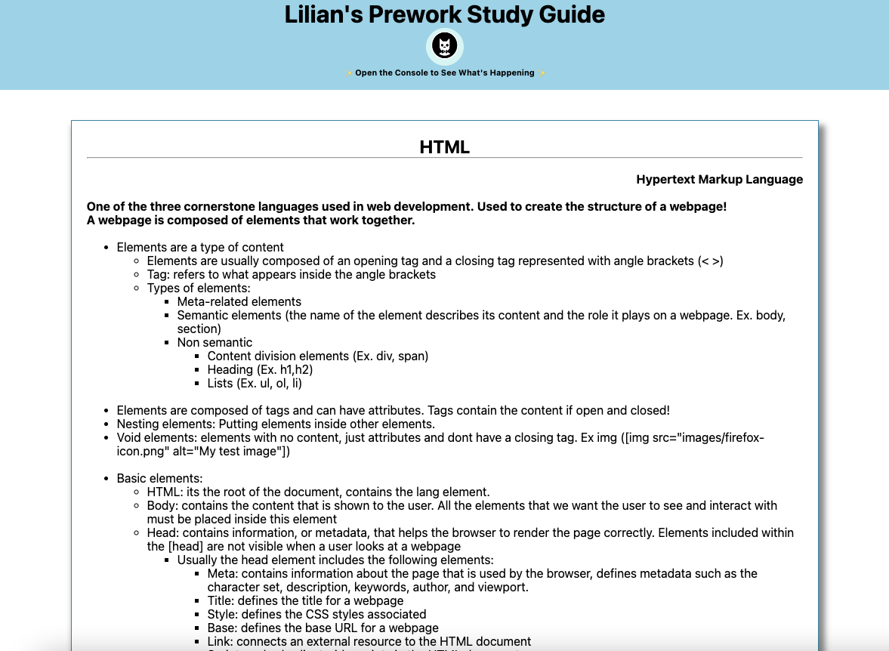

# Lilian's Prework Study Guide

## Description

This small project was, apart from being the first introduction to the bootcamp, a great way to study the fundamentals of HTML, CSS and Javascript!
I built this project to get a general idea of how to build a webpage and use git - which is used in many companies for controlling the versions of the code.
In this project are included some of the notes I took during as I followed the modules, sumarized in the key points for each section.

## Table of Contents (Optional)

If your README is long, add a table of contents to make it easy for users to find what they need.

- [Installation](#installation)
- [Usage](#usage)
- [Credits](#credits)
- [License](#license)

## Installation

To run the project in your local machine:

1. Open visual studio in your computer or laptop
2. Clone the git project: https://github.com/lilianpatinoortiz/prework-study-guide.git
3. Pull the latest from the 'main' branch
4. Locate the index.html file
5. Right click on the file and select "Open in default browser"
6. A new window on your default browser should open with the web page containing the prework study guide

## Usage

After running the project you will be able to access some basic notes from my pre-work as shown in the below images:

## Credits

List your collaborators, if any, with links to their GitHub profiles.

If you used any third-party assets that require attribution, list the creators with links to their primary web presence in this section.

If you followed tutorials, include links to those here as well.

## License

The last section of a high-quality README file is the license. This lets other developers know what they can and cannot do with your project. If you need help choosing a license, refer to [https://choosealicense.com/](https://choosealicense.com/).

---

🏆 The previous sections are the bare minimum, and your project will ultimately determine the content of this document. You might also want to consider adding the following sections.

## Badges

Badges aren't necessary, but they demonstrate street cred. Badges let other developers know that you know what you're doing. Check out the badges hosted by [shields.io](https://shields.io/). You may not understand what they all represent now, but you will in time.

## Features

If your project has a lot of features, list them here.

## How to Contribute

If you created an application or package and would like other developers to contribute to it, you can include guidelines for how to do so. The [Contributor Covenant](https://www.contributor-covenant.org/) is an industry standard, but you can always write your own if you'd prefer.

## Tests

Go the extra mile and write tests for your application. Then provide examples on how to run them here.
